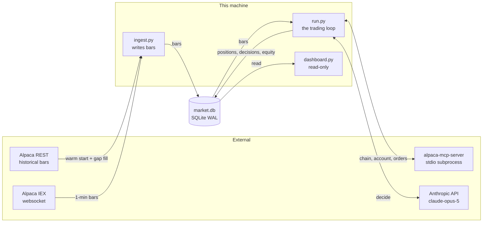
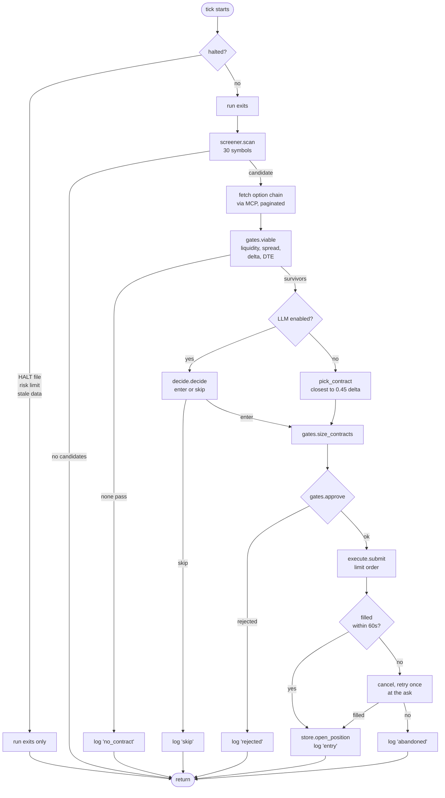
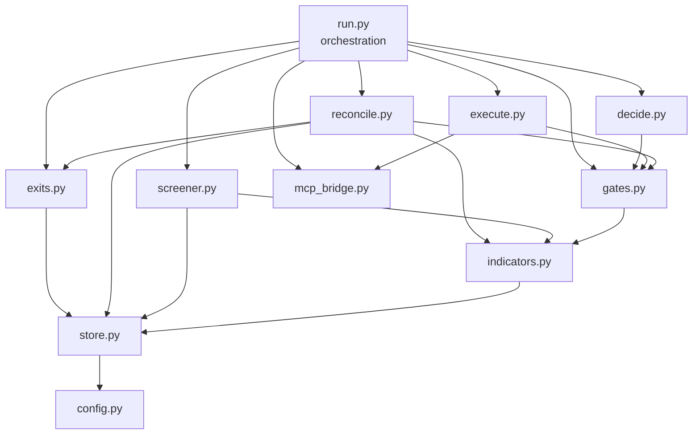
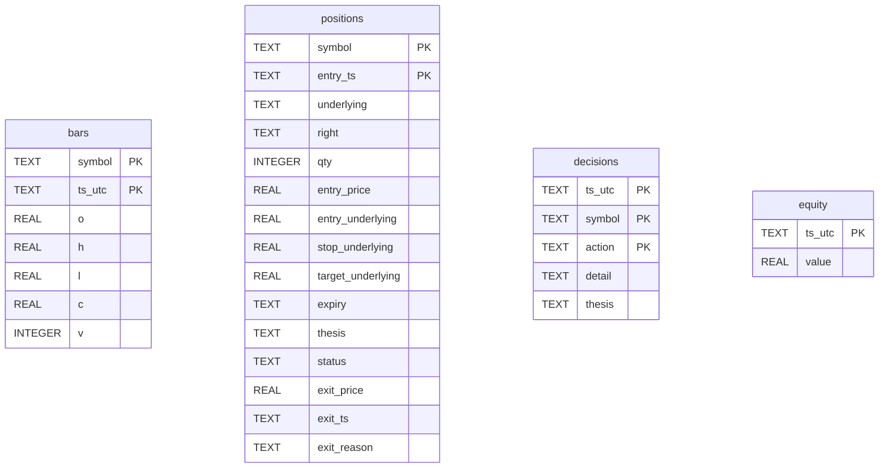

# Alpaca Options Agent

An autonomous options trading agent for the lablab.ai × Alpaca AI Trading Agents
Hackathon. It watches 30 US equities minute by minute, spots momentum breakouts,
asks Claude to pick an option contract, runs that choice through deterministic risk
gates, and places limit orders on an Alpaca paper account.

Everything it does — including every decision *not* to trade — is written to a local
SQLite database and shown on a read-only dashboard.

**This README is written as a handover document.** If you have never seen this
project before, read [The core idea](#the-core-idea), then
[Architecture](#architecture), then [Reading order](#reading-order-for-a-new-developer).
If a trading term is unfamiliar, the [Glossary](#glossary) defines all of them.

---

## Contents

- [Pre-kickoff disclosure](#pre-kickoff-disclosure)
- [Status](#status--what-actually-works-today)
- [The core idea](#the-core-idea)
- [Architecture](#architecture)
- [How one tick works](#how-one-tick-works)
- [Module reference](#module-reference)
- [Reading order for a new developer](#reading-order-for-a-new-developer)
- [Data model](#data-model)
- [Safety layers](#safety-layers)
- [Quick start](#quick-start)
- [How to extend it](#how-to-extend-it)
- [Debugging playbook](#debugging-playbook)
- [Testing](#testing)
- [Ops scripts](#ops-scripts)
- [Deployment](#deployment)
- [Design decisions and the incidents behind them](#design-decisions-and-the-incidents-behind-them)
- [Known gaps](#known-gaps)
- [Glossary](#glossary)

---

## Pre-kickoff disclosure

Per [Alpaca's official hackathon FAQ](docs/ALPACA_HACKATHON_REFERENCE.md#pre-kickoff-code--resolved-2026-08-29),
pre-existing work is **permitted** and must be **disclosed**. Judging is scoped to the
agent submitted during the event and its performance on the **official competition
paper account** (not a dev/throwaway account).

| | |
|---|---|
| **Pre-kickoff baseline tag** | `pre-kickoff-baseline` — last commit before the 28 Aug kickoff window |
| **Built before kickoff** | Ingest, screener, indicators, gates, MCP bridge, LLM decide layer, execute, exits, reconcile, dashboard, systemd deploy, ops scripts |
| **Built during the window (28 Aug – 4 Sep 2026)** | Exit live-quote fix (PR #6), competition cutover tooling, disclosure updates, bug fixes after kickoff |
| **Competition account** | A **new** Alpaca paper account with **$100,000** starting balance, separate from pre-kickoff testing |
| **Official P&L window** | Mon **31 Aug 2026 09:30 ET** → Fri **4 Sep 2026 09:30 ET** (equity snapshot EOD Thu 3 Sep) |

Pre-kickoff testing on a throwaway paper account (including trades before 31 Aug) does
**not** count toward official measurement. After cutover, only the competition account
is used on the VM.

Full rules: [`docs/ALPACA_HACKATHON_REFERENCE.md`](docs/ALPACA_HACKATHON_REFERENCE.md)

---

## Status — what actually works today

Verified 29 Aug 2026 by running the suite and reading each module.

| Component | State | Notes |
|---|---|---|
| Market data ingest | **Working** | 25-day REST warm start, live IEX websocket, exponential-backoff reconnect |
| Indicators | **Working** | EMA, ATR, RSI, RVOL, ADR, Supertrend, resampling |
| Momentum screener | **Working** | Thresholds measured against 9 real sessions via `tools/replay.py` |
| Multi-timeframe filter | **Working** | 4H Supertrend + RSI, 15m EMA200 |
| Risk gates | **Working** | 12 independent checks; nothing the LLM outputs can bypass them |
| LLM decision layer | **Working** | Claude Opus 5, constrained by a strict enum tool schema |
| Deterministic fallback | **Working** | `--deterministic` runs the full agent with no LLM |
| Order execution | **Working** | Limit only, 60s fill poll, cancel-and-retry once |
| Exit triggers | **Working** | Live option quotes; premium ±80/−40% and underlying stops; sell at bid |
| Boot reconciliation | **Working** | Local positions aligned against Alpaca before trading |
| Dashboard | **Working** | Stdlib HTTP server, inline SVG equity curve |
| Tests | **211 passing** | `python -m pytest` — 11.7s, no credentials needed |
| Deployment | **Working** | systemd units for a US-region Ubuntu VM |

---

## The core idea

The whole design is one sentence:

> **A deterministic system nominates and approves. The LLM only chooses between
> options that are already safe.**

This matters. If a language model places trades directly, a bad output is a bad
trade. Here the model sits in the middle of a sandwich:

```
   DETERMINISTIC            LLM              DETERMINISTIC        SIDE EFFECT
   ─────────────         ─────────          ──────────────       ────────────
   screener.py     →     decide.py    →     gates.py       →     execute.py
   "these 3 are          "I pick the        "approved,           "buy 2 of it"
    worth a look"         middle one"        size = 2"
```

Three structural constraints make this real, not just a convention:

**The model cannot invent a symbol.** Its tool schema restricts `symbol` to an enum
built from the exact contracts it was handed, plus the literal `"none"`. A value
outside that enum is rejected by the Anthropic API before our code sees it. This is
a schema constraint, not a prompt instruction — prompts can be talked around, enums
cannot.

**The model never decides size.** `gates.size_contracts()` is the only place a
quantity is computed. The model is never asked for one.

**The model cannot reach the market.** The MCP tools exposed to it are a read-only
allowlist of eight (`RESEARCH_TOOLS` in `mcp_bridge.py`). `place_option_order`,
`close_position` and `exercise_options_position` are simply absent from its world.

And if the model is unavailable, `--deterministic` swaps `decide()` for
`pick_contract()` — the contract closest to 0.45 delta — and the agent keeps running
with no LLM at all. Every other component is testable without one.

---

## Architecture

### Processes

Three processes share one SQLite file and nothing else. Each restarts independently.



Why three processes and not one? `StockDataStream.run()` owns its own event loop, so
combining ingest with the agent loop would mean depending on a private alpaca-py API
for no gain. Independent restart is worth more than a shared process — if the
websocket dies, the trading loop keeps managing open positions.

SQLite runs in **WAL mode**, which lets the dashboard read while ingest writes.

### One tick, end to end



### Layer dependencies

Modules only depend downward. Nothing in the bottom layer imports anything above it,
which is what makes the whole thing testable without credentials.



---

## How one tick works

The agent wakes every 60 seconds and runs `run.tick()`.

### 1. Check for a halt

Three things stop new entries:

- A `HALT` file in the repo root — `touch HALT` stops the agent by hand
- `gates.halt_reason()` — daily loss ≤ −3%, or drawdown ≤ −8% from peak
- `gates.data_stale_reason()` — no bars for 5 minutes during market hours

Day-start and peak equity are **recovered from persisted history** on boot
(`_session_bounds`), so restarting mid-session doesn't silently reset the risk limits.

### 2. Run exits — always, even when halted

This ordering is a safety property, not a style choice. An entry that fails to fire
costs an opportunity; an exit that fails to fire costs money. `exits.scan()` checks
every open position for:

| Type | Trigger | Forced? |
|---|---|---|
| Competition end | today ≥ `2026-09-04` | yes |
| Expiry proximity | DTE ≤ 2 | yes |
| Premium stop | premium down 40% from entry | no |
| Premium target | premium up 80% from entry | no |
| Underlying stop | price broke the stop level | no |
| Underlying target | price reached the target | no |

Forced exits are checked first and reported first, because they must happen
regardless of how the trade looks.

### 3. If halted, stop here

Exits have already run. Entries do not.

### 4. Screen for candidates

`screener.scan()` walks all 30 symbols. A symbol qualifies when **all** of:

- Moved **≥ 0.5 average daily ranges** from today's session open
- **RVOL ≥ 1.5** — trading at 1.5× its usual volume
- Price on the correct side of **EMA(20)** — a move that round-tripped back through
  its own average is reverting, not trending
- At least 20 bars into the session — don't judge a day on its first few minutes
- Passes the **multi-timeframe filter** (below)

Then throttles: 60-minute cooldown per symbol, max 3 entries/day, max 5 concurrent.

**The multi-timeframe filter** (`indicators.mtf_confirm`) resamples the 1-minute bars
into 4-hour and 15-minute bars and checks:

| Timeframe | Call | Put |
|---|---|---|
| 4H | Close above Supertrend(10, 3.0), direction bullish | Close below Supertrend, direction bearish |
| 4H | RSI(14) ≥ 50 | RSI(14) ≤ 50 |
| 15m | Entry price above EMA(200) | Entry price below EMA(200) |

It returns a **three-state** result: `True` (confirmed), `False` (rejected), or
`None` (not enough history — needs 11 four-hour bars and 200 fifteen-minute bars).
`None` currently **fails open**: the trade proceeds unconfirmed. See
[Known gaps](#known-gaps).

When the filter confirms, it also returns the last 4H bar's high and low. These
become the stop and target for a 1:2 reward-to-risk trade (`run._entry_levels`),
falling back to ADR-based levels when unavailable.

### 5. Fetch the option chain

For each candidate, pull contracts 3–45 days out with strikes within ±10% of spot,
via the Alpaca MCP server. `mcp_bridge.fetch_chain()` **follows pagination** — one
page is a single expiry, so ignoring the page token would mean only ever buying the
nearest weekly.

### 6. Filter contracts

`gates.viable()` rejects a contract for any of:

| Check | Threshold | Why |
|---|---|---|
| Two-sided market | bid > 0 and ask > 0 | Can't price what nobody quotes |
| DTE | 3–45 days | Too near = gamma cliff; too far = slow |
| Prior-day volume | ≥ 500 | Deep-ITM strikes last traded days ago on 4 contracts |
| Bid-ask spread | ≤ 10% of mid | A wide spread is a guaranteed loss on entry |
| Delta (absolute) | 0.35–0.55 | Directional exposure without paying for deep ITM |

`gates.parse_chain()` **drops** any snapshot missing a quote or greeks rather than
defaulting them to zero — a zero default would look like a very cheap, very safe
option.

### 7. Decide

Claude sees the candidate, the portfolio, and the already-filtered contracts. It
returns enter-or-skip with a confidence and a one-sentence thesis. The system prompt
tells it explicitly that liquidity and delta have already been checked — its job is
whether *this setup* is worth taking now. Skipping is free.

If the model returns a symbol the enum should have prevented, `parse_decision()`
treats it as **skip**, not an error. The failure mode of a decision layer must be
"do nothing", never "trade something unverified".

### 8. Size and approve

`size_contracts()` divides the 2%-of-equity budget by contract cost (ask × 100).
It returns **0** when one contract already exceeds budget — the caller must treat
that as "do not trade", never "buy one anyway".

`gates.approve()` is the last checkpoint before money moves. It **re-runs viability**
rather than trusting the earlier pass, because the chain may have moved between
nomination and execution. It also checks the 15:30 ET entry cutoff, the 10% deployed
cap, and the 5-position cap.

### 9. Place the order

**Limit orders only.** With options spreads that reach double digits on illiquid
strikes, a market order is a donation.

- Price starts at mid + 25% of the half-spread, clamped inside the quote
- Polls `get_order_by_client_id` every 2s for 60s
- If unfilled: cancel, rebuild at the ask (buy) or bid (sell), try once more
- If still unfilled: abandon and log

Every order carries a deterministic `client_order_id`
(`aoa-{symbol}-{side}-{YYYYMMDDHHMM}`, suffixed `-r` on retry) so a retry after an
ambiguous network failure cannot create a duplicate order.

### 10. Record everything

Entry, exit, rejection, skip, cancel, broker rejection, reconcile — every branch
writes a row to `decisions` with its reason. `_log_attempts()` offsets each attempt's
timestamp by one second, because the primary key is `(ts_utc, symbol, action)` and
two failed attempts in the same tick would otherwise overwrite each other.

---

## Module reference

Roughly 2,000 lines of agent code and 1,900 lines of tests across 13 modules.

| File | Lines | Responsibility | Depends on | Side effects |
|---|---|---|---|---|
| `config.py` | 47 | Universe, DB path, API keys | — | reads env |
| `store.py` | 214 | Every SQL statement in the project | — | writes SQLite |
| `indicators.py` | 341 | EMA, ATR, RSI, RVOL, ADR, Supertrend, resampling, MTF | pandas | none (pure) |
| `ingest.py` | 227 | Websocket + REST market data | alpaca-py, store | writes `bars` |
| `screener.py` | 193 | Nominates candidates | indicators, store | none |
| `gates.py` | 228 | Deterministic risk | indicators | none (pure) |
| `decide.py` | 146 | LLM decision layer | anthropic, gates | network |
| `execute.py` | 190 | Order construction, submission, polling | gates, mcp_bridge | **places orders** |
| `exits.py` | 117 | When to close a position | store | none |
| `reconcile.py` | 144 | Boot-time local ↔ broker alignment | gates, exits, indicators, store | writes `positions` |
| `run.py` | 398 | The loop; wires everything together | all of the above | orchestrates |
| `mcp_bridge.py` | 138 | stdio client for alpaca-mcp-server | mcp | spawns subprocess |
| `dashboard.py` | 182 | Read-only HTML view | store | serves HTTP |

### Key contracts

**`screener.evaluate(bars, session_date, trigger) -> Candidate | None`**
Every failure path returns `None` rather than raising — a screener that crashes on
thin data would take down the process.

**`gates.viable(contract, today, risk) -> str | None`**
Returns a **prose reason** on rejection, `None` on approval. Prose so the reason
lands in the decision log and the demo can show why the agent stood still. Every
gate function follows this convention.

**`exits.check(position, underlying, premium, today, rules) -> ExitSignal | None`**
`position` is any mapping shaped like a row of the `positions` table — so tests pass
plain dicts.

**`run.tick(conn, broker, ...) -> dict`**
`broker` only needs `fetch_chain(...)` and `place(order, dry_run=...)`. That's the
whole interface, which is why tests can pass a fake broker and never touch a network.

**`decide.decide(client, candidate, contracts, portfolio, today) -> Decision`**
`client` is injected, not constructed. **This is the swappable seam** — a multi-agent
debate ensemble can replace `decide()` without touching the screener, gates, or
execute, as long as it returns a `Decision`.

---

## Reading order for a new developer

Start at the bottom of the dependency tree. Each file only depends on the ones above
it, so nothing forward-references.

1. **`config.py`** (47 lines, no logic) — see what the agent watches and why the
   universe is capped at 30.
2. **`store.py`** — read the `SCHEMA` string at the top. Four tables is the entire
   data model, and the comments explain why each exists.
3. **`gates.py`** — the `RISK` dict at the top is every risk rule in one place. Each
   function answers one question.
4. **`screener.py`** — the module docstring contains the measured table behind the
   0.5-ADR threshold. This is what "measured, not guessed" looks like.
5. **`exits.py`** (117 lines) — short, and the asymmetry with entries is explained up
   top.
6. **`decide.py`** — see how `build_decision_tool()` constrains the model.
7. **`run.py`** — read `tick()`. Everything above comes together here.

Then read `tests/test_run.py` (464 lines) to see the branches enumerated.

The comments in this codebase explain **why**, not what, and several record real
production incidents. Those are the most valuable thing in here — see
[Design decisions](#design-decisions-and-the-incidents-behind-them).

---

## Data model

Four tables, all defined in `store.SCHEMA`.



- **`bars`** — 1-minute OHLCV. Keyed `(symbol, ts_utc)` with `INSERT OR REPLACE`, so
  re-ingesting the same window is a no-op. This matters because reconnects backfill
  overlapping ranges.
- **`positions`** — one row per fill, keyed `(symbol, entry_ts)`. "Is it open" is a
  **status column**, not the row's existence, so the same contract can be traded more
  than once over the competition.
- **`decisions`** — every decision including the ones to do nothing. Actions seen:
  `entry`, `exit`, `exit_failed`, `rejected`, `skip`, `no_contract`, `canceled`,
  `broker_rejected`, `abandoned`, `unfilled`, `reconcile`. **This is the audit trail
  and the demo artifact.**
- **`equity`** — account snapshots. The P&L curve the dashboard draws, and the source
  for recovering day-start and peak on restart.

---

## Safety layers

Outermost first. A trade must pass all ten.

| # | Layer | Where |
|---|---|---|
| 1 | Dry run is the default; `--live` required | `run.main` |
| 2 | `HALT` file stops entries (exits keep running) | `run.tick` |
| 3 | Account halts: daily −3%, drawdown −8% | `gates.halt_reason` |
| 4 | Stale-data halt: no bars 5 min during RTH | `gates.data_stale_reason` |
| 5 | Throttles: 60-min cooldown, 3/day, 5 concurrent | `screener.throttle_reason` |
| 6 | Contract gates: liquidity, spread, delta, DTE | `gates.viable` |
| 7 | Portfolio gates: 2% per trade, 10% deployed, 15:30 cutoff | `gates.approve` |
| 8 | LLM sees 8 read-only tools; cannot reach the market | `mcp_bridge.RESEARCH_TOOLS` |
| 9 | Limit orders only, never market | `execute.build_order` |
| 10 | Boot reconciliation against the broker | `reconcile.reconcile` |

---

## Quick start

```bash
python -m venv .venv
```

```bash
source .venv/bin/activate
```

Windows: `.venv\Scripts\activate`

```bash
pip install -e ".[dev]"
```

```bash
cp .env.example .env
```

Fill in `ALPACA_API_KEY`, `ALPACA_SECRET_KEY`, and `ANTHROPIC_API_KEY`.

Then in three terminals:

```bash
python -m agent.ingest
```

```bash
python -m agent.run
```

```bash
python -m agent.dashboard --host 0.0.0.0 --port 8080
```

### Agent modes

| Command | LLM? | Places orders? |
|---|---|---|
| `python -m agent.run` | yes | no (dry run) |
| `python -m agent.run --deterministic` | no | no |
| `python -m agent.run --live` | yes | **yes** |
| `python -m agent.run --live --deterministic` | no | **yes** |

`--deterministic` needs no `ANTHROPIC_API_KEY`.

### Environment variables

| Variable | Required | Purpose |
|---|---|---|
| `ALPACA_API_KEY` | yes | Alpaca paper API key |
| `ALPACA_SECRET_KEY` | yes | Alpaca secret |
| `ANTHROPIC_API_KEY` | LLM mode only | Claude decision layer |
| `ALPACA_PAPER_TRADE` | no | Defaults to `true` |

`config.api_keys()` raises at startup rather than returning `None`, so a
misconfigured process fails immediately instead of at the first API call.

---

## How to extend it

### Add or remove a symbol

Edit `UNIVERSE` in `config.py`. **The cap is 30** — Alpaca's free tier rejects the
entire subscription past the plan cap rather than trimming it, so an oversized
universe means *no bars at all*. `_stream_once()` raises loudly instead of letting
you discover this as a staleness halt mid-session.

Pick for options liquidity, not just volatility — a wide spread just gets rejected by
`gates.viable()` later.

### Change a screener threshold

Edit `TRIGGER` in `screener.py`, then **re-run the measurement**:

```bash
python -m tools.replay 0.4 0.5 0.6 0.75
```

This replays the screener over stored bars at six checkpoints per session (60, 120,
180, 240, 300, 360 minutes after the open) and prints candidates per day and how many
sessions produced nothing. The current 0.50 was chosen from this table, not by taste.

The error here is asymmetric: too few nominations starves the agent, too many just
gives the gates more to reject.

### Change a risk rule

Edit `RISK` in `gates.py`. Every rule is in that one dict. Add a test in
`tests/test_gates.py` — each gate is a pure function, so tests are three lines.

### Swap the decision layer

`decide.decide()` is the seam. Anything with this signature works:

```python
def decide(client, candidate, contracts, portfolio, today) -> Decision
```

A multi-agent debate ensemble, a different model, a scoring heuristic — none of it
touches `screener`, `gates`, or `execute`. Pass your object as `decide_client` to
`run.loop()`.

### Add an exit rule

Add the condition to `exits.check()`. Put forced exits (things that must happen
regardless of P&L) **above** the discretionary block. Return an `ExitSignal` with
`forced=True`.

### Add an MCP tool the model can see

Add the name to `RESEARCH_TOOLS` in `mcp_bridge.py`. **Only add read-only tools.**
The allowlist is what stops a confused model from reaching the market.

---

## Debugging playbook

### The agent isn't trading

Work down this list — it's ordered by how often each is the cause.

1. **Is it halted?** `grep halted logs/` or check the dashboard. A `HALT` file, a
   risk limit, or stale data will show a reason.
2. **Are bars arriving?** `ops/health.sh`, or:
   ```bash
   sqlite3 data/market.db "SELECT MAX(ts_utc) FROM bars"
   ```
   If that's more than a few minutes old during RTH, ingest is the problem.
3. **Is the screener firing?** `python -m ops/screener_why.py` shows per-symbol
   evaluation. Most likely: a quiet tape means nothing clears 0.5 ADR.
4. **Are contracts passing the gates?** Check `decisions` for `no_contract` or
   `rejected` rows — the `detail` column has the exact reason.
   ```bash
   sqlite3 data/market.db "SELECT * FROM decisions ORDER BY ts_utc DESC LIMIT 20"
   ```
5. **Is the model skipping?** Look for `skip` rows; `thesis` has its reasoning.

### Ingest keeps reconnecting

Check for `connection limit exceeded`. Alpaca allows one websocket per API key — if
two processes (say, local and the VM) use the same key, they lock each other out.
The backoff caps at 120s; it will recover once the other process stops.

### A position exists at the broker but not locally (or vice versa)

That's what `reconcile.py` is for; it runs on boot. Restart the agent. Ghost closes
are deferred for 3 minutes after entry, because the broker's position endpoint can
lag a genuine fill by ~44 seconds.

### Tests pass but live behaves differently

The most common cause is payload shape. `alpaca-mcp-server` returns positions under
`result`; older builds and some tests use `positions` or `snapshots`.
`reconcile._option_positions()` handles all three. If you add a new MCP call, check
what the real payload looks like before trusting a test fixture.

---

## Testing

```bash
python -m pytest
```

211 tests, ~12 seconds, **no credentials and no network required**.

The design that makes this possible:

- `gates.py` and `indicators.py` are pure functions — no I/O at all
- `tick()` takes a `broker` object with two methods, so tests pass a fake
- `decide()` takes an injected `client`, so tests pass a stub response
- `tests/conftest.py` provides one fixture: a `store.connect()` on `tmp_path`
- `tests/helpers.make_bars()` generates deterministic ascending bars

One test file per module. `test_run.py` is the largest (464 lines) because `tick()`
has the most branches — including the exit-before-entry ordering, which is asserted
explicitly.

```bash
python -m tools.replay
```

Not a test — a measurement tool. Replays the screener over stored bars to tune
thresholds against real data.

---

## Ops scripts

Require the [Alpaca CLI](https://github.com/alpacahq/cli) on the machine. The trading
path uses **MCP**; these use the **CLI**.

| Script | Purpose |
|---|---|
| `ops/cli_demo.sh` | Account + clock + positions — judge-facing smoke test |
| `ops/health.sh` | Bar freshness and process check |
| `ops/flatten.sh` | Emergency close-all |
| `ops/eod_snapshot.sh` | Equity snapshot to `logs/` |
| `ops/live_health.py` | SQLite + service health summary |
| `ops/screener_why.py` | Per-symbol screener explanation |
| `ops/explain_positions.py` | Why each open position is still open |
| `ops/audit_today.py` | Today's decision audit |
| `ops/eod_session_report.py` | End-of-session report |
| `ops/validate_live.py` | Pre-flight checks before going live |
| `ops/competition_cutover.py` | Backup + wipe decisions/positions/equity; keeps `bars` |
| `ops/equity_summary.py` | Equity curve summary |

---

## Deployment

A US-region Ubuntu VM. Copy `deploy/systemd/*.service` to `/etc/systemd/system/`,
set `WorkingDirectory` and `EnvironmentFile`, then:

```bash
sudo systemctl enable --now alpaca-ingest alpaca-agent alpaca-dashboard
```

The units run as `ubuntu` from `/opt/alpaca-options-agent` with
`Restart=always, RestartSec=15`. The agent unit runs `--live --interval 60` and
starts `After=alpaca-ingest.service`.

Run it in a **US region** — latency to Alpaca matters, and the websocket is less
likely to drop.

### Competition setup

The hackathon requires a **fresh $100,000 paper account**, with the agent trading
from **Monday 31 August, 09:30 ET**. Equity is snapshotted **EOD Thursday
3 September**, including exercises and assignments for options expiring that day.

Do not use the pre-kickoff development account. Cutover is a manual, human step
handled via `ops/competition_cutover.py`.

---

## Design decisions and the incidents behind them

These are the non-obvious parts. Each was a real failure.

**The websocket went mute for 19 hours.** `alpaca-py`'s `data_timeout` defaults to
`None`, which disables its only defence against a socket that stays TCP-ESTABLISHED
while the remote side goes silent. Transport-level ping/pong doesn't catch it. No
exception is raised, so the reconnect logic never engages. Fixed by setting
`data_timeout=120.0`.

**A flat 5s reconnect locked itself out.** Alpaca needs longer than 5 seconds to
release a stale connection slot for the same key, so every retry landed while the
previous one still counted — a self-sustaining lockout that ran for over an hour.
Fixed with exponential backoff capped at 120s, plus a reset after 60s of successful
connection so an unrelated later failure doesn't inherit an old backoff.

**A position was closed as a ghost 44 seconds after filling.** Two independent
causes: the payload key was `result`, not `positions`, so the parser saw zero
positions; and the broker's position endpoint genuinely lags fills. Fixed with
multi-key payload handling, a `_broker_positions_usable()` guard so an error never
looks like "zero positions", and a 3-minute grace window.

**A cancel-and-retry was invisible.** An AAPL order canceled once and retried once,
and the decision log showed only the original intent. Fixed with the `attempts` trail
in `execute.submit()` and `_log_attempts()` in `run.py`.

**Two failed attempts overwrote each other.** `decisions` is keyed
`(ts_utc, symbol, action)`, so two `canceled` rows in the same tick collided under
`INSERT OR REPLACE`. Fixed by offsetting each attempt's timestamp by one second.

**Risk limits reset on restart.** `loop()` set day-start and peak to current equity
on every boot, silently clearing the daily-loss and drawdown gates on any redeploy.
Fixed with `_session_bounds()`, which recovers both from persisted equity history.

**SQLite write-lock contention.** Two writer processes on one file, with Python's 5s
default lock wait, failed during bulk warm-start writes. Fixed with a 15s timeout and
by wrapping `executemany` in one explicit transaction — under `isolation_level=None`,
each row was otherwise committing individually and re-acquiring the lock per row.

**Only ever buying the nearest weekly.** `get_option_chain` returns one page per
expiry with a `next_page_token`. Ignoring it meant never seeing anything but a 3-DTE
contract. Fixed with pagination in `fetch_chain()`.

---

## Known gaps

Honest list of what isn't done. Ordered by impact.

| Gap | Impact | Where |
|---|---|---|
| No per-underlying cap | Multiple positions in the same stock (e.g. 3 MSFT calls) are allowed; concentration risk | `gates.approve` |
| No multi-leg spreads | Only single-leg orders. Alpaca supports `mleg` (spreads, iron condors); the rules place no restriction on strategies. | `execute.build_order` |
| MTF fails open | When history is thin, `mtf_confirm()` returns `None` and the trade proceeds unconfirmed rather than being blocked. | `screener.evaluate` |
| No per-underlying cap | Two MSFT positions can open simultaneously, doubling correlated exposure. | `gates.approve` |
| No `orders` table | Order attempts are logged as `decisions` rows, not first-class order records. | `store.SCHEMA` |
| Greeks underused | `get_option_snapshot` returns full greeks and IV; only delta is used. | `gates.parse_chain` |
| Expiry-day exposure not modelled | ITM contracts auto-exercise at ≥$0.01. With the equity snapshot on 3 Sep, expiring positions directly move the judged number. | `exits.check` |
| Dashboard is single-threaded-ish | `ThreadingHTTPServer`, fine for a few viewers. Marked `# ponytail:` in the source. | `dashboard.py` |

---

## Glossary

For anyone new to options or market data.

**Ask** — the price a seller will accept. You buy at the ask.

**Bid** — the price a buyer will pay. You sell at the bid.

**Mid** — halfway between bid and ask. The fair-ish value.

**Spread** — ask minus bid. A 10% spread means you lose 10% the instant you enter and
exit. This is why `gates.viable()` rejects wide spreads.

**Call** — an option that profits when the underlying goes **up**.

**Put** — an option that profits when the underlying goes **down**.

**Premium** — what an option contract costs. Quoted per share; one contract covers
100 shares, so a $1.50 premium costs $150.

**Underlying** — the stock the option is derived from. `AAPL250620C00200000`'s
underlying is AAPL.

**OCC symbol** — the standard option identifier.
`AAPL` + `250620` (2025-06-20 expiry) + `C` (call) + `00200000` ($200.00 strike).
`gates.parse_occ()` decodes it.

**Strike** — the price at which the option can be exercised.

**DTE** — days to expiration.

**ITM (in the money)** — the option has intrinsic value. A call is ITM when the stock
is above the strike. **ITM options auto-exercise at expiry** if ≥$0.01 ITM.

**Delta** — how much the option price moves per $1 move in the underlying. 0.45 delta
≈ 45 cents per dollar. Also a rough proxy for probability of finishing ITM. The agent
targets 0.35–0.55: real directional exposure without paying for deep ITM.

**IV (implied volatility)** — the market's expectation of future movement, baked into
the price.

**Greeks** — delta, gamma, theta, vega. Sensitivities of the option price. Only delta
is currently used.

**Gamma cliff** — near expiry, delta swings violently. This is why `min_dte: 2` is a
forced exit.

**RTH (regular trading hours)** — 09:30–16:00 America/New_York. `indicators._is_rth()`
handles DST correctly rather than assuming a fixed UTC offset.

**ADR (average daily range)** — mean high-minus-low over recent sessions. The
volatility yardstick. Deliberately **not** ATR: ATR folds in the overnight gap, which
is irrelevant when measuring a move that starts at the opening bell.

**RVOL (relative volume)** — today's volume versus typical volume for the same time
of day. RVOL 1.5 means 50% busier than usual.

**EMA (exponential moving average)** — a moving average weighted toward recent bars.

**RSI** — momentum oscillator, 0–100. Above 50 is generally bullish.

**Supertrend** — an ATR-based trend indicator giving a level and a direction
(+1 bullish, −1 bearish).

**Paper trading** — simulated money against real market data. No real funds are
involved anywhere in this project.

**Limit order** — buy/sell at a specified price or better. **Market order** — buy/sell
at whatever price is available. The agent never uses market orders.

**Multi-leg / `mleg`** — one order combining several option contracts, e.g. a spread.
Not yet implemented here.

---

## Submission artifacts

| Artifact | Location |
|---|---|
| Rules & API reference | [`docs/ALPACA_HACKATHON_REFERENCE.md`](docs/ALPACA_HACKATHON_REFERENCE.md) |
| One-page write-up | [`docs/submission/ONE_PAGER.md`](docs/submission/ONE_PAGER.md) |

---

## Disclosure

Paper trading is a simulation. It does not involve real funds or actual securities
transactions, and results are hypothetical. Options trading carries high risk and is
not suitable for all investors. This project was built for a hackathon and is not
investment advice.
